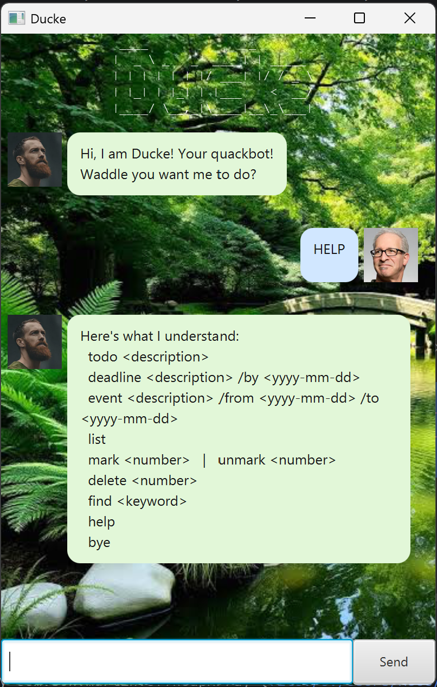

# Ducke User Guide

**Ducke** is a desktop chatbot for managing your
tasks (todos, deadlines, and events). You interact with it by typing commands
into a chatroom-style graphical interface, and it keeps track of everything for you,
saving your tasks automatically between sessions.



## Quick start

1. Ensure you have **Java 25** installed on your computer.
2. Download the latest `Ducke.jar` from the releases page.
3. Copy the file to the folder you want to use as the home folder for Ducke.
4. Open a command terminal, `cd` into that folder, and run:
   ```
   java -jar duke.jar
   ```
5. The GUI should appear in a few seconds. Type a command in the box and press
   Enter (or click **Send**) to run it. Try typing `help` to see what Ducke can do.

## Features

> **Notes on command format**
> - Words in `UPPER_CASE` are the details you supply, e.g. in `todo DESCRIPTION`,
>   `DESCRIPTION` is a placeholder for text such as `read book`.
> - Dates must be in `yyyy-mm-dd` format, e.g. `2019-10-15`.


### Commands are case-insensitive.


### Adding a todo: `todo`

Adds a simple task with no date attached.

Format: `todo DESCRIPTION`

Example: `todo read book`

```
Added:
[T][ ] read book
Now you have 1 task in the list.
```

### Adding a deadline: `deadline`

Adds a task that must be done by a certain date.

Format: `deadline DESCRIPTION /by yyyy-mm-dd`

Example: `deadline return book /by 2019-10-15`

```
Added:
[D][ ] return book (by: Oct 15 2019)
Now you have 2 tasks in the list.
```

### Adding an event: `event`

Adds a task that spans a start and end date.

Format: `event DESCRIPTION /from yyyy-mm-dd /to yyyy-mm-dd`

Example: `event project meeting /from 2019-10-01 /to 2019-10-02`

```
Added:
[E][ ] project meeting (from: Oct 1 2019 to: Oct 2 2019)
Now you have 3 tasks in the list.
```

### Listing all tasks: `list`

Shows every task currently in your list, in order.

Format: `list`

```
1. [T][ ] read book
2. [D][ ] return book (by: Oct 15 2019)
3. [E][ ] project meeting (from: Oct 1 2019 to: Oct 2 2019)
```

### Marking a task as done: `mark`

Marks the task at the given number as done (shown with an `X`).

Format: `mark INDEX`

Example: `mark 1`

```
Quack! I've marked this task as done:
[T][X] read book
```

### Marking a task as not done: `unmark`

Reverts the task at the given number back to not done.

Format: `unmark INDEX`

Example: `unmark 1`

```
Quack! I've marked this task as not done yet
[T][ ] read book
```

### Deleting a task: `delete`

Removes the task at the given number from the list.

Format: `delete INDEX`

Example: `delete 2`

```
Removed:
[D][ ] return book (by: Oct 15 2019)
Now you have 2 tasks in the list.
```

### Finding tasks by keyword: `find`

Shows all tasks whose description contains the given keyword (case-sensitive).

Format: `find KEYWORD`

Example: `find book`

```
Here are the quacking tasks in your list:
1. [T][ ] read book
```

### Viewing help: `help`

Lists all the commands Ducke understands and their formats.

Format: `help`

### Exiting the program: `bye`

Exits Ducke. The farewell also reports how many mistakes you made this session.

Format: `bye`

```
Quack quack! (bye bye)
You made 0 mistakes this session.
```

## Command aliases

For faster typing, most commands have a short alias:

| Alias | Full command |
|-------|--------------|
| `t`   | `todo`       |
| `d`   | `deadline`   |
| `e`   | `event`      |
| `m`   | `mark`       |
| `u`   | `unmark`     |
| `del` | `delete`     |
| `ls`  | `list`       |
| `f`   | `find`       |

For example, `t read book` does the same thing as `todo read book`.

## Saving your data

Ducke saves your tasks to disk automatically after every command, so your list
is restored the next time you launch the app. There is no need to save manually.

## Ducke's personality

Ducke is a well-behaving bot with no anger issues whatsoever.
If you type in too many incorrect commands...

## Command summary

| Action        | Format                                          |
|---------------|-------------------------------------------------|
| Add todo      | `todo DESCRIPTION`                              |
| Add deadline  | `deadline DESCRIPTION /by yyyy-mm-dd`          |
| Add event     | `event DESCRIPTION /from yyyy-mm-dd /to yyyy-mm-dd` |
| List          | `list`                                          |
| Mark          | `mark INDEX`                                     |
| Unmark        | `unmark INDEX`                                   |
| Delete        | `delete INDEX`                                   |
| Find          | `find KEYWORD`                                   |
| Help          | `help`                                           |
| Exit          | `bye`                                            |
